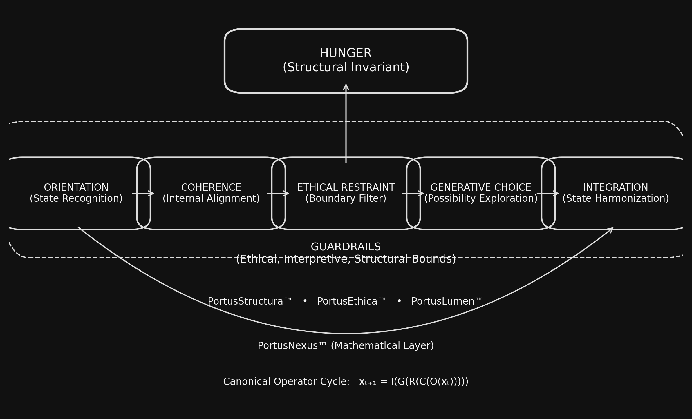

# Funding Discussion — Narrative Capsule

PortusSophia™ Going-Live Bundle

This document provides the narrative background for how PortusSophia™ has been sustained so far and why a transparent, optional support pathway is part of the going-live plan. It pairs directly with the `README.md` in this folder and should be read as a companion piece — not a standalone funding mechanism.

### 📘 Want to Understand the Project?

See the **[PortusSophia™ Navigation Map](../public-appendix/navigation-map.md)**
for the full conceptual orientation of the framework.

---

## 1. The Reality Behind the Work

PortusSophia™ was not born out of institutional funding or well-resourced labs.It emerged through:

- A $250 computer upgraded through literal plasma donations
- Personal credit, primarily Cammie's, to access essential AI and GitHub tooling
- Months of unpaid development time
- A commitment to governance-first design even when resources were scarce

The fact that the system exists at all is a testament to perseverance rather than budget.

This narrative is shared not to dramatize, but to **humanize** the origin story of the project and to acknowledge the real cost behind its creation.

---

## 2. Why Talk About Funding Now?

As PortusSophia™ approaches public visibility, sustainability becomes a legitimate consideration.Operating expenses exist whether acknowledged or ignored:

- Hardware lifecycle and upgrades
- Cloud, domain, and security costs
- GitHub organization and tooling
- AI compute for testing, research, and development
- Time investment for stewardship, reviews, and public documentation

Discussing these openly ensures the project does not drift into opacity or hidden burdens.

---

## 3. Support Is Optional — Not Expected

A support pathway (e.g., GoFundMe) may be added after the public launch.

It is intended for individuals who:

- Believe in the project
- Want to help stabilize early development
- Have the means to contribute without strain

It will never be presented as:

- Required
- Urgent
- Transactional
- A path to authority
- A membership tier

No one who contributes will receive elevated access, influence, or interpretive authority.
PortusEthica™ remains fully in force.

---

## 4. Guardrails and Responsibilities

This discussion adheres to the ethical boundaries defined in the directory’s README:

- **No coercion**
- **No authority through money**
- **Transparency in all mechanisms**
- **Clear separation of identity and funding**
- **Public visibility for all support channels**

Nothing here should be interpreted as investment solicitation or a promise of future financial return.

---

## 5. What Happens Later

Once PortusSophia™ is live:

- The Founder may publish a public support link
- A GitHub Discussion thread may open for community dialogue
- Sustainability guidelines may evolve based on stewardship guidance
- Formal investment pathways (if ever needed) will be handled with legal oversight, not improvisation

For now, this file simply records **the truth of the journey** and sets the stage for ethical transparency.

---

## 6. Final Note

If PortusSophia™ has value to you — intellectually, ethically, or personally — and you one day choose to support it, that support is received with gratitude but never expectation.

If you simply read, reflect, and walk away, that is welcomed too.

Either path honors the spirit of the project.

### How the Framework Fits Together

The PortusSophia™ architecture is defined by a single coherent Navigation Map:

For a deeper understanding of the framework you are supporting, see the
**[PortusSophia™ Navigation Map](../public-appendix/navigation-map.md)**.
