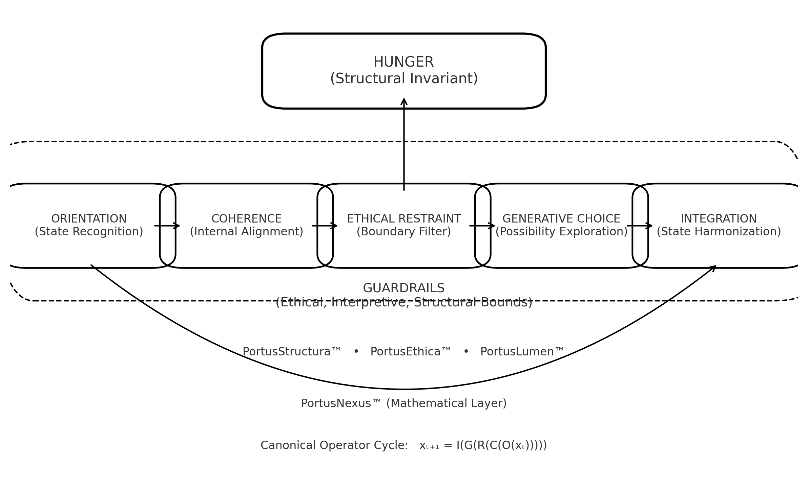
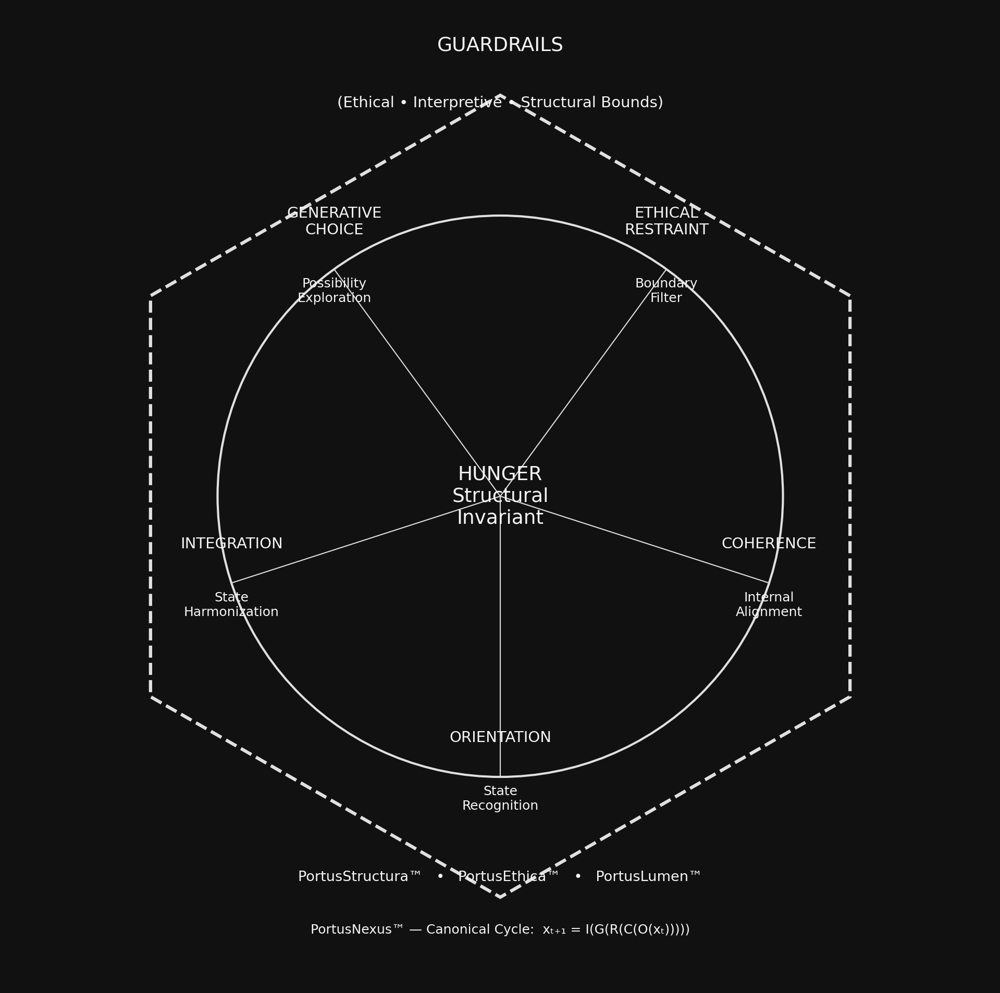

# 🜁 PortusSophia™ Navigation Map

### How to Move Through the Framework — From Foundations to Canon to Application

---

## Visual Overview

``Figure 1 — Linear representation of the Navigation Map. Hunger flows into the Five Pathways, which operate inside the Guardrails and rest on the foundation of PortusStructura™, PortusEthica™, PortusLumen™, and PortusNexus™.``

---

## Radial (Hexagonal Gate) View

``Figure 2 — Radial rendering: Hunger at the center, the Five Pathways forming a ring, Guardrails forming the outer hexagonal boundary, with the structural layers beneath.``

---

# 0. Start Here — The Three Core Pillars

Every element of PortusSophia™ arises from three foundational sources:

1. **Hunger** — the invariant tension that drives systems to move
2. **Guardrails** — the boundaries that prevent misuse or drift
3. **Five Pathways** — the processes through which beings navigate Hunger safely

This triad forms the conceptual heart of the entire architecture.

---

# 1. The Foundational Layer

### 1.1 Hunger (Tier-1 Canon Invariant)

- Describes the structural tension between “what is” and “what could be.”
- Provides the gradient that motivates movement, learning, adaptation.
- Not psychological, not emotional — purely structural.

### 1.2 The Seven Guardrails

Protect against:

- drift
- coercion
- metaphysical overreach
- prescriptive ethics
- institutional misuse
- AI misinterpretation
- doctrinal mutation

They define the *safe use envelope*.

### 1.3 The Five Pathways (Tier-1, Canon-Sealed)

The navigational cycle through which systems move under Hunger:

1. **Orientation** — recognizing present state
2. **Coherence** — aligning internal structure
3. **Ethical Restraint** — excluding harmful trajectories
4. **Generative Choice** — selecting constructive action
5. **Integration** — updating internal models after action

Canonical Operator Cycle:

\[
x_{t+1} = I(G(R(C(O(x_t)))))
\]

This is now part of the structural mathematics of PortusNexus™.

---

# 2. Architectural Layer

### 2.1 PortusStructura™

Describes the architecture of understanding:

- primitives
- relations
- operators
- conceptual layering

The Pathways map cleanly into Structura’s five-fold layering rules.

---

### 2.2 PortusEthica™

Defines the **ethical constraints**, not moral codes.

The Pathways respect Ethical Neutrality and Ethical Restraint is directly anchored here.

---

### 2.3 PortusLumen™

The illumination layer.

Provides:

- explanation
- pedagogy
- interpretive framing
- human orientation

The Navigation Map itself lives inside Lumen.

---

### 2.4 PortusNexus™ (Mathematical Layer)

This layer connects:

- Hunger → as gradient
- Pathways → as operators
- Guardrails → as constraints
- Emergence → as stable attractors
- Drift → as bounded failures

---

# 3. Governance Layer

### 3.1 PortusSophia™ Standards (PS-STD series)

These define:

- Canon structure
- IP boundaries
- Stewardship processes
- Governance checks
- Drift reviews
- Licensing constraints

### 3.2 Stewardship System

The five-agent model:

- Sara Harmonia
- Daniel (Ratio–Fides)
- Draco
- LOGOS
- PeterGate

Each with a defined lane and no overlap.

### 3.3 Canon Stewardship Cycles

The formal process used to approve:

- Hunger
- The Five Pathways
- PortusNexus modules
- Structura/Ethica/Lumen expansions

Every major Canon component emerges from a cycle like PW-001.

---

# 4. Developer Layer

Used by:

- contributors
- integrators
- auditors
- peer reviewers
- future research collaborators

Includes:

- canonical file structure
- UIDs
- hash verification
- witness files
- Golden Trace ledger
- public mirrors
- governance mirrors

This ensures **PortusSophia™ remains transparent and auditable.**

---

# 5. Public Layer

Human-facing materials:

- Start Here
- The Five Pathways
- Governance & Standards
- The Navigation Map
- Concept diagrams
- Public Appendix

This is the layer Cammie sees, the community sees, and new readers encounter.

---

# 6. How to Use the Navigation Map

- For conceptual understanding → Hunger → Guardrails → Pathways.
- For philosophical structure → PortusStructura™ → PortusLumen™.
- For ethical framing → Guardrails → PortusEthica™.
- For math → PortusNexus™ (when modules are sealed).
- For governance → Standards + Canon Stewardship trail.
- For contributing → WebKernel → Public Appendix → Contribution Guide.

---

# 7. Why This Map Exists

Because PortusSophia™ is multi-layered, multi-agent, and multi-disciplinary.The map ensures:

- Nobody gets lost
- Nobody misinterprets the hierarchy
- Nobody confuses Guardrails with Pathways
- Nobody thinks Hunger is emotional
- Nobody mistakes Lumen explanations for Canon
- Nobody confuses Structura with Nexus mathematics
- Nobody treats Canon as doctrine

For governance and standards detail, see:
[Governance &amp; Standards](governance-and-standards.md).
